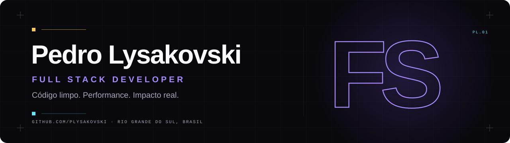
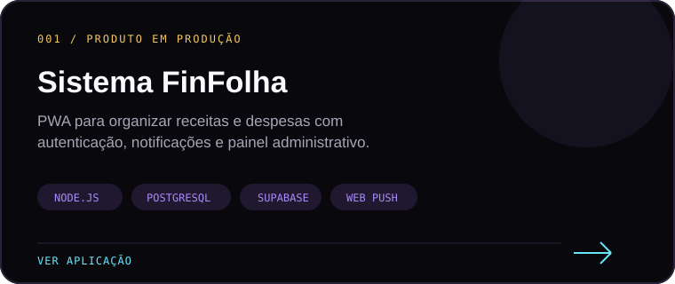
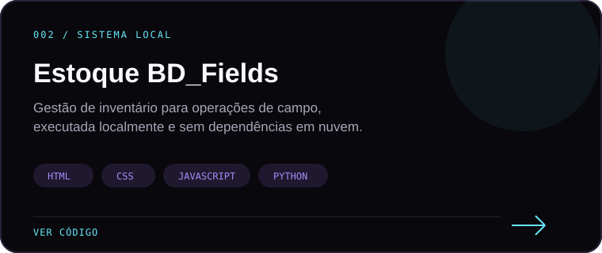
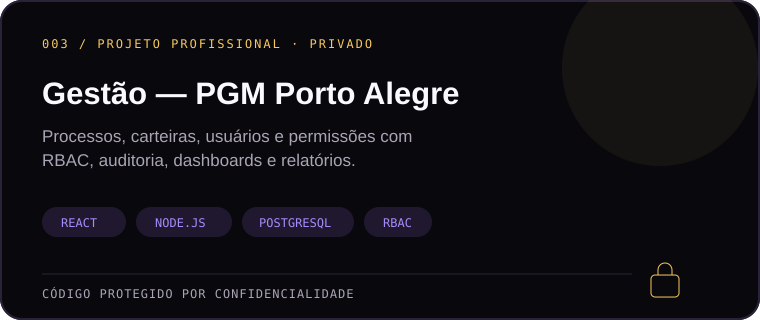
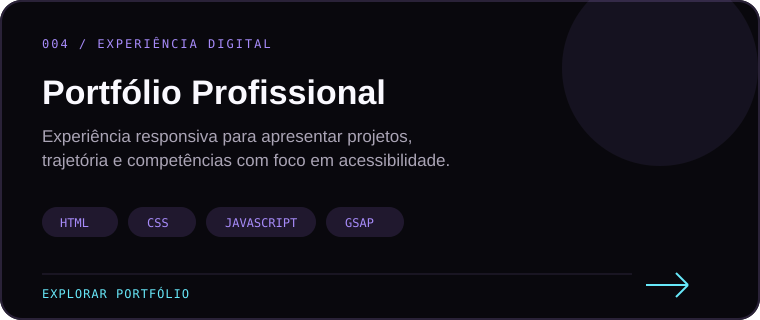
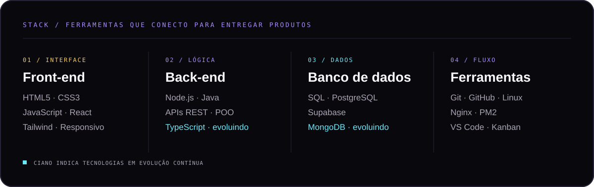
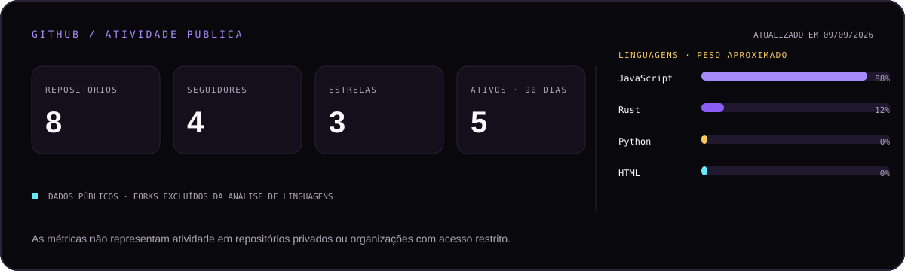

<picture>
  <source media="(prefers-color-scheme: dark)" srcset="./assets/readme/hero-dark.svg" />
  <source media="(prefers-color-scheme: light)" srcset="./assets/readme/hero-light.svg" />
  
</picture>

<h1 align="center">Desenvolvedor Full Stack que transforma requisitos em produtos reais.</h1>

<p align="center">
  Da interface ao banco de dados, construo aplicações web claras, rápidas e acessíveis.<br>
  Experiência profissional em desenvolvimento de software e suporte de TI em ambiente corporativo.
</p>

<p align="center">
  <a href="https://plysakovski.github.io/Plysakovski_Repositorio/"></a>
  <a href="https://www.linkedin.com/in/plysakovski/"></a>
  <a href="mailto:plysakovski@gmail.com?subject=Contato%20via%20GitHub"></a>
</p>

## Sobre mim

Sou **Desenvolvedor Full Stack** e **Técnico em Informática pelo IFRS Campus Osório**. Minha trajetória reúne desenvolvimento front-end e back-end, suporte técnico para operações corporativas e produtos autorais criados para resolver problemas concretos.

```text
LOCALIZAÇÃO     Rio Grande do Sul, Brasil
FORMAÇÃO ATUAL  Graduação em Inteligência Artificial · FIAP
FOCO            Desenvolvimento web · APIs · Bancos de dados · Acessibilidade
DISPONIBILIDADE Oportunidades, colaborações e projetos de software
```

## Trabalho em destaque

<p align="center">
  <a href="https://sistema-fin-folha.onrender.com/"></a>
  <a href="https://github.com/plysakovski/Sistema-de-Estoque"></a>
</p>

<p align="center">
  
  <a href="https://plysakovski.github.io/Plysakovski_Repositorio/"></a>
</p>

<details>
<summary><strong>Acesso de demonstração do Sistema FinFolha</strong></summary>

<br>

- Aplicação: [sistema-fin-folha.onrender.com](https://sistema-fin-folha.onrender.com/)
- Usuário: `demofinfolha@gmail.com`
- Senha: `finfolha2026`

</details>

## Stack técnica

<p align="center">
  
</p>

## Experiência e formação

| Período | Experiência |
| :--- | :--- |
| **2026 — presente** | **Técnico em Informática · Nova Ranp Tecnologia**<br>Suporte N1/N2 para mais de 200 usuários, administração de chamados, dispositivos corporativos e documentação técnica. |
| **2026** | **Desenvolvedor Full Stack · Y4 Solutions**<br>Desenvolvimento de soluções web completas, versionamento com Git, colaboração em equipe e práticas ágeis. |
| **Em andamento** | **Graduação em Inteligência Artificial · FIAP** |
| **Concluído em 2025** | **Técnico em Informática · IFRS Campus Osório** |

## Evolução contínua

- Arquitetura de software, Clean Architecture e DDD
- Testes automatizados com Jest, Cypress e Playwright
- TypeScript, React e desenvolvimento de APIs REST
- Inteligência Artificial aplicada a produtos de software
- CI/CD, infraestrutura em nuvem e segurança de aplicações

## Atividade pública no GitHub

<p align="center">
  
</p>

As métricas são produzidas diariamente neste repositório usando a API oficial do GitHub. Elas mostram somente dados públicos e não tentam estimar trabalho realizado em repositórios privados.

<p align="center">
  <picture>
    <source media="(prefers-color-scheme: dark)" srcset="https://raw.githubusercontent.com/plysakovski/Plysakovski/output/github-contribution-grid-snake-dark.svg" />
    <source media="(prefers-color-scheme: light)" srcset="https://raw.githubusercontent.com/plysakovski/Plysakovski/output/github-contribution-grid-snake.svg" />
    
  </picture>
</p>

## Vamos construir algo juntos?

Se você procura alguém que combine visão de produto, desenvolvimento Full Stack e experiência prática em ambientes corporativos, vamos conversar.

<p align="center">
  <a href="https://plysakovski.github.io/Plysakovski_Repositorio/">Portfólio</a>
  &nbsp;·&nbsp;
  <a href="https://www.linkedin.com/in/plysakovski/">LinkedIn</a>
  &nbsp;·&nbsp;
  <a href="mailto:plysakovski@gmail.com?subject=Contato%20via%20GitHub">E-mail</a>
</p>


